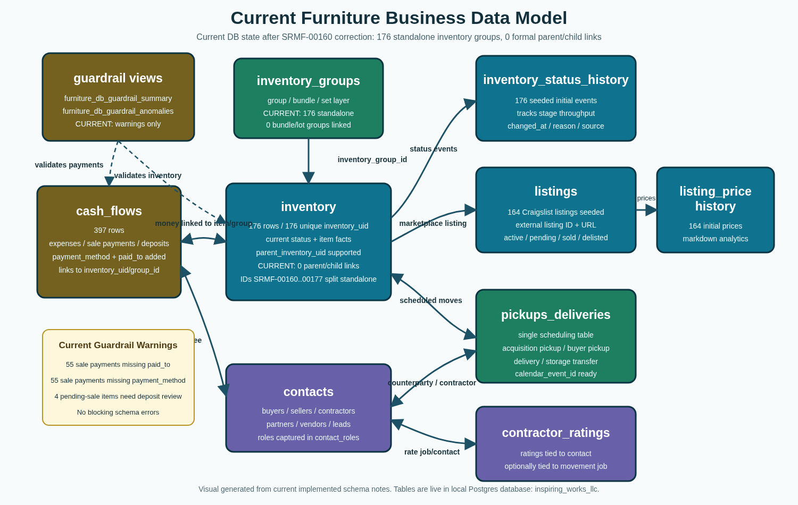

# AI-Assisted Furniture Operations System

[](https://github.com/Matthew-T-Fergusson/furniture-ops-ai-system/actions/workflows/ci-smoke.yml)

**Repository short description:** A live AI-assisted operations system for a furniture resale business, built to convert spreadsheet-based tracking into structured, auditable, database-backed workflows.

This repository documents a live AI-assisted operations system for a furniture resale business.

The system began as spreadsheet-based tracking and was converted into a Postgres-backed operational database and workflow layer. It is currently used to support real business activity while being expanded into a fuller operating system for inventory, sourcing, purchases, sales, receipts, pickups, deliveries, listing history, cash flow, and reporting.

Rather than using AI only for ad hoc tasks, this project uses an AI agent as an operational assistant working against a persistent database, documented workflows, and guardrails.

The goal is to turn messy, high-context business operations into structured, auditable, AI-accessible workflows.

## Current Operating Status

This is a **sanitized public portfolio version** of the live system.

The private operating system is already used to support business activity. This public repository excludes sensitive records and focuses on the architecture, data model, workflows, guardrails, analytics layer, recovery pattern, and development path.

Private customer records, receipts, financial details, credentials, and internal operating data are intentionally excluded.

Current state:

- Operational MVP under active development
- Postgres-backed operating layer replacing spreadsheet-first tracking
- Structured source of truth for inventory, listings, cash flow, contacts, logistics, status history, receipts, and reporting concepts
- Agent-assisted workflow layer for repeatable data-entry and review patterns
- SQL guardrails and regression tests for common risky or incomplete writes
- Agent action audit trail pattern for reviewable AI-assisted operations
- Analytics materialized views for operating KPIs and status aging
- Backup/recovery documentation and public-safe reference scripts
- Synthetic sample data only in the public repository

Scope boundaries:

- The public repo does not contain private operational data.
- Human review remains central for ambiguous decisions, external actions, and financial/legal consequences.
- The public repository is documentation/reference code for the operating system, not a packaged commercial product.

## Business Problem

Furniture resale operations create a lot of messy, high-context data:

- inventory acquired from many sources
- furniture sets that are split, bundled, relisted, or partially sold
- purchase costs, labor, storage, deposits, refunds, delivery fees, and final sale payments
- customer/contact records scattered across chats and marketplace threads
- receipts and expense evidence that must stay connected to accounting records
- pickups, deliveries, storage transfers, and contractor coordination
- listing URLs, price changes, stale listings, pending sales, and sold/delivered status changes

Spreadsheets can track this at small scale, but they become fragile as volume increases. The business needs a structured source of truth that can support process discipline, auditability, reporting, and AI-assisted workflows without exposing private operational details.

## System Capabilities

The system supports, or is being built to support:

- Inventory lifecycle tracking with status history
- Parent/child cost-basis handling for sets, bundles, split listings, and remainder pieces
- Cash-flow records for purchases, deposits, split payments, final payments, refunds, labor, storage, and expenses
- Tax/reporting category taxonomy for reusable resale-business expense and revenue review
- Payment-method tracking at the individual money-movement level
- Receipt/image audit trail concepts for expense capture, file paths, OCR, and extracted transaction details
- Contact, buyer, seller, contractor, and partner role modeling
- Pickup, delivery, storage-transfer, and buyer-pickup scheduling models
- Listing identity, marketplace URL, asking price, and price-history tracking
- Relist-needed and stale-status workflow hooks
- Guardrail views that surface incomplete or risky operational states
- Analytics views for inventory pipeline, sales margin, cash flow, listing performance, storage cost, disposed-inventory write-offs, status aging, transitions, cycle time, and operating KPIs
- Public-safe backup/recovery pattern for encrypted offsite database recovery

## AI-Assisted Workflow Layer

The system is designed for agent-assisted operations, where an AI agent works against a persistent database, documented workflows, and guardrails instead of only performing one-off ad hoc tasks.

The agent layer is intended to:

- normalize chat-style inputs into database-backed records
- enforce required fields and workflow rules before writes
- surface exceptions and missing information instead of silently guessing
- refresh or query operational views for decision support
- preserve auditability through status history, guardrails, and `agent_action_log`
- document human feedback/corrections so future agents can avoid repeating mistakes
- keep humans in control of ambiguous decisions, external actions, and financial/legal consequences

The important design principle is not “autonomy.” It is **structured assistance**: using an AI workflow layer to make real business operations more consistent, reviewable, and queryable.

## Architecture



Core documentation:

- [`docs/ARCHITECTURE.md`](docs/ARCHITECTURE.md)
- [`docs/DATA_MODEL.md`](docs/DATA_MODEL.md)
- [`docs/WORKFLOWS.md`](docs/WORKFLOWS.md)
- [`docs/GUARDRAILS.md`](docs/GUARDRAILS.md)
- [`docs/AGENT_ACTION_LOG.md`](docs/AGENT_ACTION_LOG.md)
- [`docs/TAXONOMY.md`](docs/TAXONOMY.md)
- [`docs/ANALYTICS.md`](docs/ANALYTICS.md)
- [`docs/BACKUP_RECOVERY.md`](docs/BACKUP_RECOVERY.md)
- [`docs/PORTFOLIO_CASE_STUDY.md`](docs/PORTFOLIO_CASE_STUDY.md)

## Quick Start

```bash
cp .env.example .env
docker compose up -d
make ci-smoke
```

The SQL files in `sql/` initialize the schema, guardrail views, synthetic sample rows, and dashboard-ready analytics materialized views.

## Dashboard Generation

This repo includes a runnable public-safe static dashboard generator built against the synthetic analytics layer:

```bash
python3 scripts/export_dashboard_context.py --output reports/dashboard/dashboard_context.json
python3 scripts/generate_kpi_dashboard.py --output-dir reports/dashboard
```

Use `--analysis-file` to inject operator-written executive commentary. The generator renders metrics and tables; it intentionally does not invent executive analysis in Python.

## Analytics and Disaster Recovery

- `docs/ANALYTICS.md` explains the KPI materialized views, including inventory pipeline, margin, listing performance, status aging, transitions, and cycle-time metrics.
- `scripts/export_dashboard_context.py` exports public-safe dashboard context from the synthetic DB.
- `scripts/generate_kpi_dashboard.py` renders a public-safe static HTML dashboard from the analytics views, with optional injected analysis.
- `skills/furniture-ops-dashboard-report/SKILL.md` captures the dashboard-reporting workflow: code builds metrics/charts, while operator-authored analysis provides executive commentary, anomaly cues, and work-item prioritization.
- `docs/BACKUP_RECOVERY.md` documents the secure restore model: GitHub for code/runbooks, encrypted backups offsite, and the decryption passphrase stored separately.
- `scripts/create_encrypted_backup.sh` and `scripts/upload_encrypted_backup_to_drive.sh` are public-safe reference scripts. They are heavily commented to show the restore logic without exposing private backup destinations or secrets.

## Tests and CI Smoke

Run the same schema/guardrail gate locally and in GitHub Actions:

```bash
make ci-smoke
```

The smoke test resets the local public-reference database schema, loads `sql/001_schema.sql`,
`sql/002_guardrail_views.sql`, `sql/003_sample_seed.sql`, and
`sql/004_analytics_views.sql`, then fails if the synthetic seed produces any
error-severity guardrails. It also runs
`tests/guardrail_regressions.sql`, which exercises representative guardrail cases
using synthetic rows only:

- listing identity
- pending sale deposit / reserved-until
- sold-delivered completeness
- zero-cost basis
- group cost allocation
- sold/status alignment
- dashboard KPI unsold-count regression
- disposed-inventory COGS/write-off KPI regression
- status-history analytics population

## Portfolio / Hiring Manager Summary

This repository shows how a real small-business workflow can be converted from spreadsheet tracking into a database-backed operating layer that is structured enough for AI assistance.

The work demonstrates:

- practical domain modeling for messy operations
- normalized Postgres schema design for real business events
- guardrails that catch incomplete or inconsistent writes
- audit-trail structure for AI-assisted actions, previews, failures, and human corrections
- regression tests for operational data-quality rules
- analytics views shaped around operating decisions rather than abstract metrics
- reusable cash-flow taxonomy for operational and tax-aware dashboarding
- privacy-conscious public documentation of a live internal system
- a development path toward auditable AI-assisted workflows

The strongest theme is converting high-context business activity into structured, auditable, AI-accessible operational systems.

## Repository Name

Current repository name:

```text
furniture-ops-ai-system
```

Reason: the name reflects the current positioning as an AI-assisted operations system rather than an early experiment.

Alternative names considered:

- `furniture-ops-system`
- `ai-assisted-furniture-ops`
- `furniture-operations-platform`
- `resale-ops-ai-system`

## Before / After Positioning

Before:

> A proof-focused sample project showing how furniture resale workflows could be modeled with Postgres and AI-agent concepts.

After:

> A live AI-assisted operations system for a furniture resale business, built to convert spreadsheet-based tracking into structured, auditable, database-backed workflows. This repository is the sanitized public portfolio version of that live system.

## Privacy Note

This repository uses synthetic/anonymized sample data. It intentionally excludes real receipts, contacts, legal documents, addresses, private notes, credentials, raw operational exports, and sensitive financial details.
